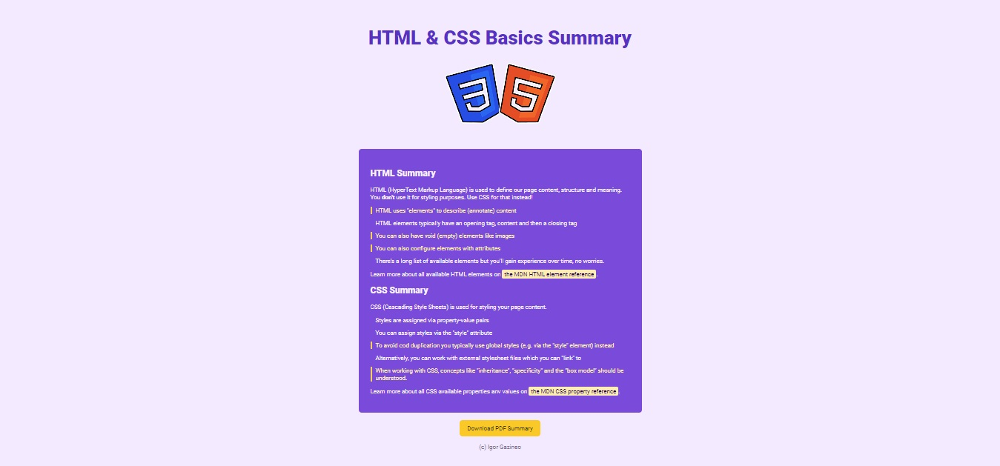

# HTML & CSS Basics Summary

## Screenshots

## Sobre:

Segundo projeto desenvolvido no curso 100 Days Of Code - 2024 Web Development Bootcamp, onde eu pude aplicar os conhecimentos adquiridos na parte inicial do curso sobre os fundamentos de HTML e CSS.

## Stack utilizada

**Front-end:**   

